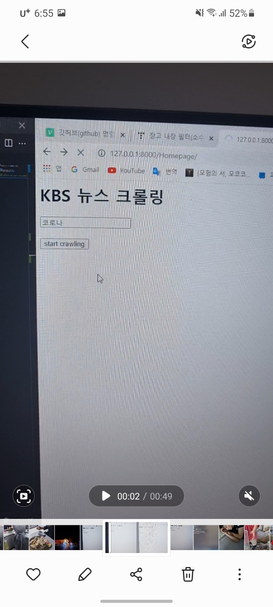
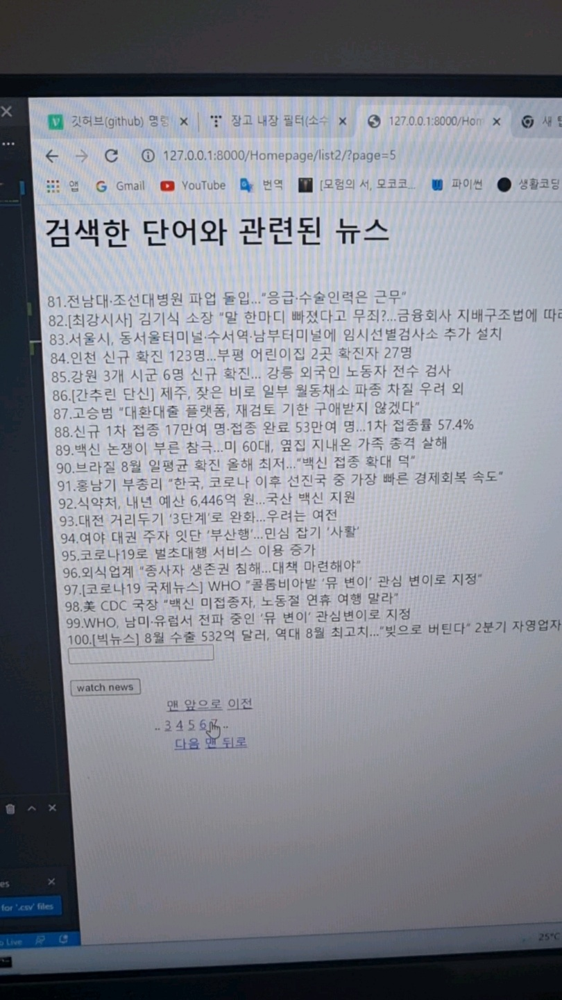
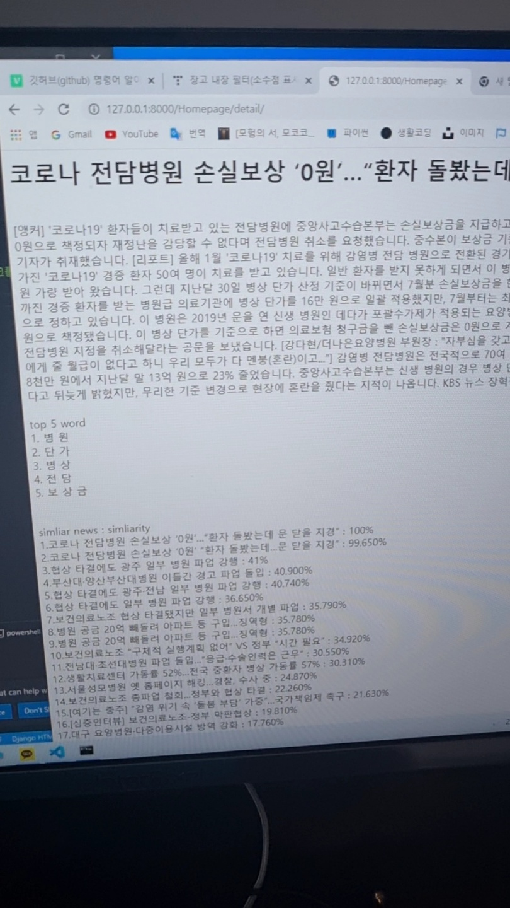

<div id="top"></div>


<!-- PROJECT LOGO -->
<br />
<div align="center">

  <h3 align="center">KBS news web crawling</h3>

  <p align="center">
    If you want to see kbs news about the word you want, try it!
    <br/>
    It provides similar news and similarities.
    <br/>
    It also extracts the top 5 words that appear the most  
    <br/>
    <a href="https://github.com/goragoraki/web_crawling_pj"><strong>Explore the docs »</strong></a>
    <br />
    <br />
    <a href="https://github.com/goragoraki/web_crawling_pj">Report Bug</a>
    ·
    <a href="https://github.com/goragoraki/web_crawling_pj">Request Feature</a>
  </p>
</div>


<!-- TABLE OF CONTENTS -->
<details>
  <summary>Table of Contents</summary>
  <ol>
    <li>
      <a href="#about-the-project">About The Project</a>
      <ul>
        <li><a href="#built-with">Built With</a></li>
      </ul>
    </li>
    <li>
      <a href="#getting-started">Getting Started</a>
      <ul>
        <li><a href="#prerequisites">Prerequisites</a></li>
        <li><a href="#installation">Installation</a></li>
      </ul>
    </li>
    <li><a href="#usage">Usage</a></li>
    <li><a href="#roadmap">Roadmap</a></li>
    <li><a href="#contributing">Contributing</a></li>
    <li><a href="#license">License</a></li>
    <li><a href="#contact">Contact</a></li>
    <li><a href="#acknowledgments">Acknowledgments</a></li>
  </ol>
</details>


<!-- ABOUT THE PROJECT -->
## About The Project
<div align="center">
  <a href="http://khuhub.khu.ac.kr/2017103951/today_fortune">
    
  </a>
</div>


If you enter a search term you want, it will extract news in the order of the most search terms among kbs news. If you select a news among them, the content of the news is displayed, and the 5 most frequent words in the news are displayed, and other similar news are displayed below it. The degree of similarity is also indicated here. :smile:
  
  
When searching for a word, the news was found by comparing it with the desired word through morphological analysis using the konlpy library.
  

Similarity was evaluated using cosine similarity to evaluate the similarity of news.


<p align="right">(<a href="#top">back to top</a>)</p>


### Built With

* [django](https://www.djangoproject.com/)
* [konly](https://konlpy.org/en/latest/)

<p align="right">(<a href="#top">back to top</a>)</p>


<!-- GETTING STARTED -->
## Getting Started

How to set up a project locally.
To get a local copy and run it, simply follow this simple example:


### Installation


setting


1. The default number of crawls is 1000.  
  If you want change, adjust code cw/views.py 
  ~~~python
  def News_Crawl(request):
      news_num = int(1000)
  ~~~ 
2. Clone the repo
   ```
   git clone https://github.com/goragoraki/web_crawling_pj
   ```
3. Runserver
  In cmd, py manage.py runserver
<p align="right">(<a href="#top">back to top</a>)</p>


<!-- USAGE EXAMPLES -->
## Usage

Excute local  
  

Homepage (search word)
<a href="https://github.com/goragoraki/web_crawling_pj">
    
</a>
<br/>
<br/>
Result of search
<a href="https://github.com/goragoraki/web_crawling_pj">
    
</a>
<br/>
<br/>
Select news
<a href="https://github.com/goragoraki/web_crawling_pj">
    
</a>
you can see top5 words and similarity news and similarity


<p align="right">(<a href="#top">back to top</a>)</p>


<!-- CONTRIBUTING -->
## Contributing

If you have suggestions to improve this project, please fork the repository and create a pull request. Thank you!

1. Fork the Project
2. Create your Feature Branch 
3. Commit your Changes 
4. Push to the Branch 
5. Open a Pull Request

<p align="right">(<a href="#top">back to top</a>)</p>


<!-- LICENSE -->
## License

None

<p align="right">(<a href="#top">back to top</a>)</p>


